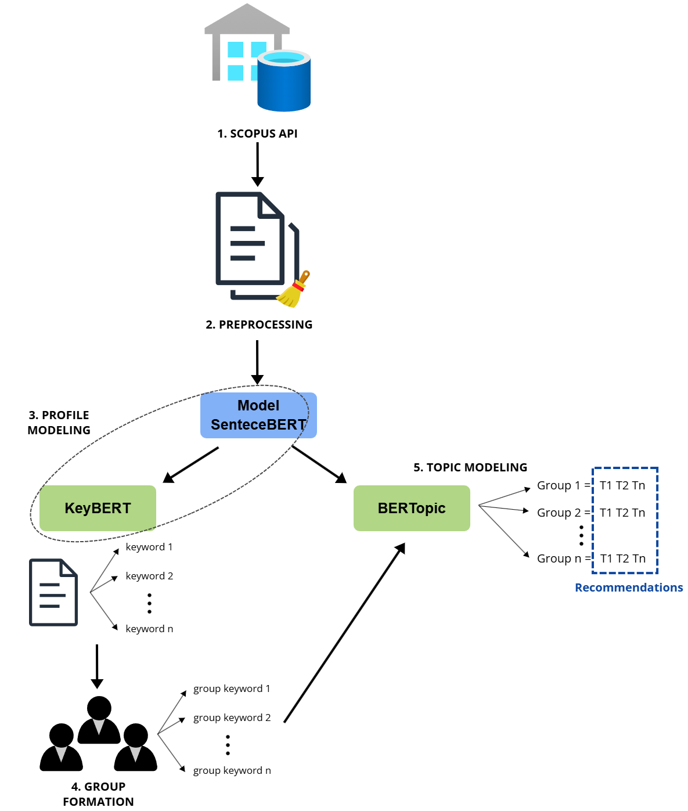

# Novel Content Recommendation for Academic Groups

---

This repository contains the notebooks developed for the implementation of a group recommender system focused on novel academic content. The work is based on the thesis titled:  
**"RECOMENDACIÓN DE CONTENIDO NOVEDOSO PARA GRUPOS ACADÉMICOS BASADO EN ALGORITMOS DE INTELIGENCIA ARTIFICIAL"**  
Author: Carlos Antonio Ayala Tipán

---

## General Description

The thesis aims to implement a content recommendation model for academic groups using artificial intelligence algorithms. The main methods include topic modeling with BERTopic, keyword extraction with KeyBERT and SBERT, and group formation with FP-Growth.

---

### Proposed Approach

The project follows a structured methodology to generate recommendations for academic groups. Below is the conceptual diagram representing the proposed approach:



---

## Repository Structure

---

### 1. Preprocessing.ipynb
This notebook performs **data preprocessing** through:
- Text normalization.
- Removal of special characters, stopwords, and punctuation.
- Conversion of text to lowercase.

This step ensures that the data is ready for subsequent modeling, improving analysis quality.

---

### 2. SentenceBERT.ipynb
Implements **SBERT** to generate dense semantic text representations. Its main functions include:
- Generating embeddings for titles and abstracts.
- Comparing semantic similarities between publications.
- Facilitating author preference modeling.

---

### 3. KeyBERT.ipynb
Dedicated to keyword extraction using **KeyBERT**. This model:
- Generates keywords based on the semantic context of the text.
- Utilizes embeddings generated by SBERT.
- Improves the precision of relevant term extraction.

---

### 4. Generated_groups.ipynb
This notebook groups authors using the **FP-Growth** algorithm, based on collaboration criteria. Includes:
- Identification of authors who collaborated on at least three publications.
- Calculation of similarities and analysis of novelty index for each group.

---

### 5. BERTopic.ipynb
Focused on topic modeling with **BERTopic**:
- Generates topics from abstracts.
- Uses clustering to group semantically related documents.
- Provides specific recommendations based on relevant and novel topics for academic groups.

---

## Installation

1. Clone the repository:
   ```bash
   git clone https://github.com/carlos-ayala/academic-recommender.git
   ```

---

## Prerequisites

- Python 3.8+
- Access to the Scopus API
- Required libraries: `sentence-transformers`, `keybert`, `bertopic`, `pandas`, `numpy`, among others.

---

## Key Results

The system's results include:
- **Relevant keywords** and **novel topics** for academic groups.
- Formation of **meaningful collaborative groups** based on publication patterns.

---

## Contributions

This project contributes to:
- Optimizing the process of identifying novel research topics.
- Facilitating academic collaboration.
- Providing a replicable framework for group recommender systems.

---

## License

This project is licensed under the **GNU General Public License v3.0**.  
You can find the full license text in the `LICENSE` file or visit the following link for more details:  
[GNU GPL v3.0 License](https://www.gnu.org/licenses/gpl-3.0.en.html)

---

## Contact

For more information, feel free to reach out via:
- **Email**: [k_arlos210@hotmail.com](mailto:k_arlos210@hotmail.com)
- **Phone**: +593 983281723

---